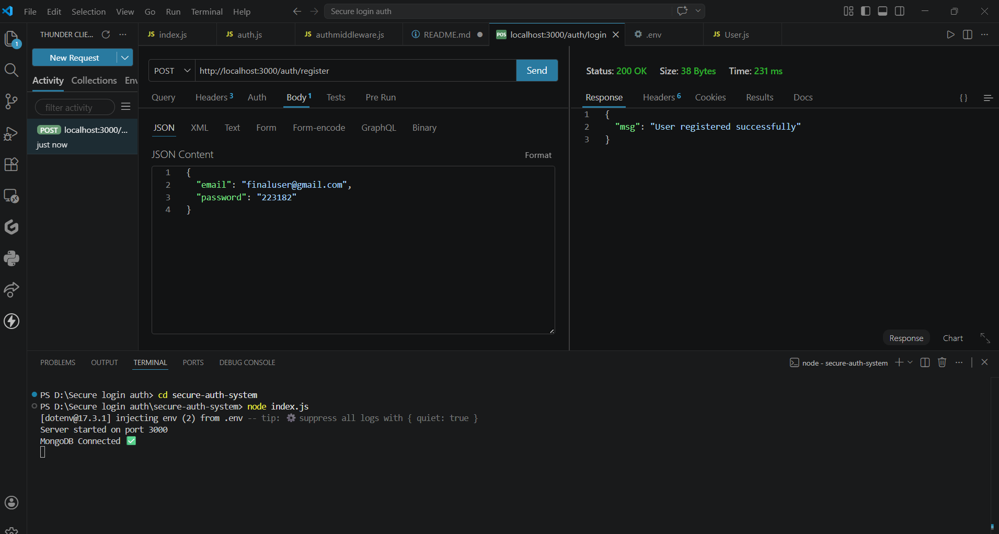
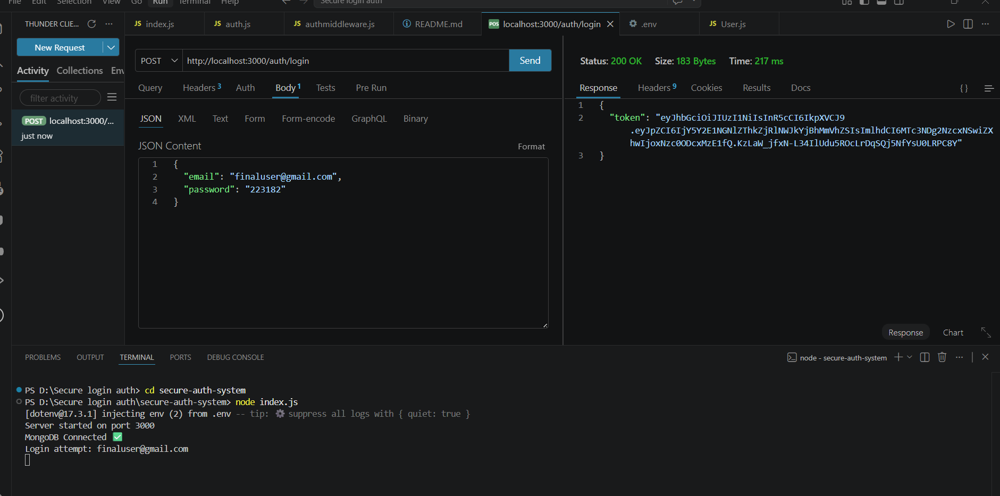
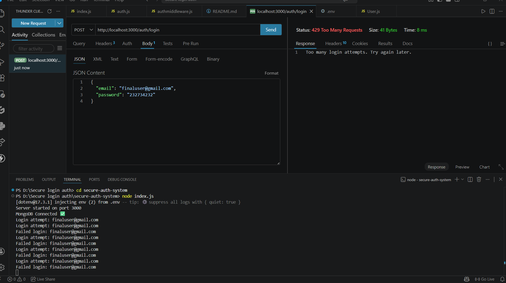

<!-- # 🔐 Secure Authentication System

A secure authentication system built using Node.js, Express, and MongoDB with advanced cybersecurity features.

---

## 🚀 Features

- User Registration & Login
- Password Hashing using bcrypt
- JWT Authentication
- Protected Routes
- Brute Force Protection (Rate Limiting)
- Login Attempt Logging

---

## 🛡️ Security Features

- Prevents brute-force attacks
- Secure password storage using bcrypt
- Token-based authentication using JWT
- Environment variable protection (.env)

---

## 🧪 API Endpoints

### 🧾 Register
POST /auth/register

### 🔐 Login
POST /auth/login

### 🔒 Protected Route
GET /auth/dashboard

---

## ⚙️ Tech Stack

- Node.js
- Express.js
- MongoDB
- JWT (jsonwebtoken)
- bcrypt
- express-rate-limit

---

## 📌 How to Run

```bash
npm install
node index.js

## 📌 How to Run

```bash
npm install
node index.js
```

---

## 📷 Demo Screenshots

### 🧾 User Registration



### 🔐 User Login (JWT Token)



### 🛡️ Brute Force Protection

 -->

# 🔐 Secure Authentication System with Brute Force Protection

A production-ready authentication system built using Node.js, Express, and MongoDB with advanced security features like JWT authentication, account lockout, rate limiting, and email alerts for suspicious activity.

---

## 🚀 Key Highlights

* 🔐 JWT-based authentication system
* 🛡️ Brute-force attack protection (account lockout)
* ⏱️ Rate limiting to prevent abuse
* 🔒 Secure password hashing using bcrypt
* 📧 Email alerts on suspicious login attempts
* 🧠 Login attempt tracking & logging

---

## 💡 Why This Project?

This project demonstrates real-world cybersecurity practices used in modern backend systems to protect user accounts from unauthorized access and attacks.

---

## ⚙️ How It Works

1. User registers → password is hashed using bcrypt
2. User logs in → credentials verified
3. JWT token is generated for authentication
4. Failed login attempts are tracked
5. After 5 failed attempts → account is locked
6. Email alert is sent to user
7. Protected routes require valid JWT token

---

## 🛡️ Security Features

* 🔒 Password hashing (bcrypt)
* 🚫 Brute-force protection (account lock system)
* ⏳ Rate limiting (prevents spam attacks)
* 🔑 JWT authentication
* 📧 Email alerts for suspicious activity
* 🔐 Environment variable protection (.env)

---

## 🧪 API Endpoints

### 📄 Register

POST /auth/register

### 🔐 Login

POST /auth/login

### 🔒 Protected Route

GET /auth/dashboard

---

## 📷 Demo Screenshots

### 🧾 User Registration


### 🔐 User Login (JWT Token)


### 🛡️ Brute Force Protection


---

## ⚙️ Tech Stack

* Node.js
* Express.js
* MongoDB
* JWT
* bcrypt
* express-rate-limit
* Nodemailer

---

## 📁 Project Structure

secure-auth-system/
│── models/
│── routes/
│── middleware/
│── utils/
│── screenshots/
│── .env
│── index.js

---

## 📌 How to Run

```bash
npm install
node index.js
```

---

## 💼 Resume Highlight

Built a secure authentication system using Node.js, Express, and MongoDB implementing JWT-based authentication, password hashing, brute-force protection with account lockout, rate limiting, and real-time email alerts for suspicious login attempts.

---
